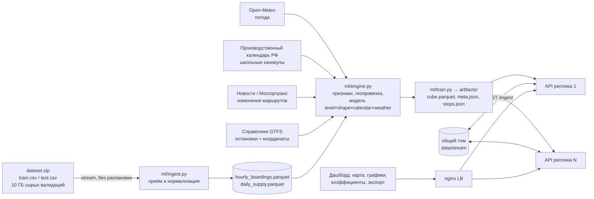

# TramCast — ИИ-прогноз загрузки трамвайных маршрутов Москвы

Сервис прогнозирует **посадки (успешные валидации) по маршруту × дата × час** на горизонтах
**день (почасово) / месяц / год**, агрегирует по маршруту, остановке и интервалу времени,
показывает динамику на карте Москвы, позволяет менять корректирующие коэффициенты и выгружать CSV/XLSX.

| Что | Значение |
|---|---|
| Метрика соревнования | WAPE-score = 1 − Σ\|y−ŷ\| / Σy (почасово) |
| Out-of-time валидация (fit строго до даты прогноза) | **0.903 / 0.919 / 0.922** (с фильтром частиц; было 0.904 / 0.916 / 0.919) (окт / 13–31 окт / март, direct); 61-дн. горизонт: гибрид 0.9135 (зима), 0.9008 (осень) |
| Вероятностный прогноз | 80 %-интервалы P10–P90, покрытие 0.81 (осень) / 0.90 (зима) out-of-sample |
| Теоретический потолок (неустранимый почасовой шум) | ≈ **0.92** (см. «Потолок точности») |
| Производительность (Docker, 2 vCPU / 2 ГБ) | **300 RPS при p95 53 мс, CPU 49 % (кэш); без кэша 300 RPS p95 280 мс, CPU 70 %; RAM ~220 МиБ; compose nginx + 2 реплики проверен** |
| Лидерборд | sub_v6 = **0.89233**; текущий кандидат v7 (фильтр частиц) |
| Файл решения | `submissions/submission.csv` (14 640 строк, формат `route;date;hour;prediction`) |

---

## 1. Быстрый старт

**Для жюри — запуск сервиса (данные не нужны, артефакты модели уже в репозитории):**

```bash
git clone https://github.com/EhimenNathan/tramcast-moscow.git && cd tramcast-moscow
docker compose up --build          # http://localhost:8080 (nginx → 2 реплики API, по 2 vCPU / 2 ГБ) — проверено
docker compose up --scale api=4    # горизонтальное масштабирование без изменений кода
```

Дашборд: `http://localhost:8080/` · Swagger/OpenAPI: `http://localhost:8080/docs` · здоровье: `/health` · метрики: `/metrics`.
Один контейнер без балансировщика: `docker build -t tramcast . && docker run --cpus 2 --memory 2g -p 8080:8000 tramcast`.

**Полное воспроизведение модели** (Python 3.12+). Данные организаторов в репозиторий не включены — положите
`dataset.zip` рядом и выполните:

```bash
pip install -r requirements-ml.txt
python ml/ingest.py --zip ../dataset.zip   # потоковый разбор 62 млн валидаций из zip (без распаковки, ~20 мин) +
                                          # извлечение labels/ и справочника остановок → data/
python ml/backtest.py                     # out-of-time валидация → artifacts/validation.json
python ml/horizon_eval.py && python ml/intervals.py   # 61-дневный горизонт, калибровка интервалов P10/P90
python ml/train.py                        # обучение → artifacts/* и submissions/submission.csv (детерминированно)
uvicorn backend.app.main:app --workers 2 --port 8000
```

`Dockerfile` — лёгкий рантайм на готовых артефактах; `Dockerfile.train` — переобучение внутри контейнера
(`docker build -f Dockerfile.train .`, требует `data/` после `ingest.py`, ~1.5 ГБ).

| Папка | Содержимое |
|---|---|
| `ml/` | приём данных, модель (фильтр частиц, гибрид, календарь), обучение, валидация, интервалы, нагрузочные метрики модели |
| `backend/app/` | REST API (FastAPI) + дашборд (`static/`: карта Leaflet, графики Chart.js) |
| `config/` | календарь РФ, режимы маршрутов (ремонты), гиперпараметры |
| `artifacts/` | обученная модель: куб прогнозов, состояние фильтра частиц, остановки, интервалы, отчёт валидации |
| `data/` | внешние данные (погода Open-Meteo, световой день, OpenStreetMap); данные организаторов — после `ingest.py` |
| `loadtest/` | нагрузочные тесты и их результаты (JSON) |
| `research/` | исследовательские скрипты (турнир моделей, эксперименты) |
| `submissions/submission.csv` | прогноз ноябрь–декабрь 2025 (14 640 строк) |

---

## 2. Архитектура



| Модуль | Файл | Ответственность |
|---|---|---|
| Приём/нормализация | `ml/ingest.py` | потоковое чтение CSV из zip чанками по 1 млн строк; `validation_result==1`; маршрут из `ngpt_route`; час из `tran_date_time`; хвосты соседних месяцев; число вагонов/выходов в день |
| Признаки/геопривязка | `ml/engine.py`, `ml/train.py` | календарь, погода, режимы маршрутов, фильтр аномалий Хампеля; привязка к остановкам GTFS (`stops.json`) |
| ML-прогноз/агрегация | `ml/engine.py` | модель, горизонты день/месяц/год, nowcast фактами из потока |
| API | `backend/app/main.py`, `store.py` | REST, агрегации, коэффициенты, экспорт, приём потока, метрики |
| Frontend | `backend/app/static/*` | карта Москвы (Leaflet), графики (Chart.js), коэффициенты, экспорт |

Рекомендованный стек (Java/Spring, React/TS) заменён на **Python/FastAPI + статический SPA**: модель и
сервис на одном языке, без ONNX-моста; SPA не требует сборки. На пропускную способность это не влияет
(см. «Производительность») — узкое место любой реализации здесь сеть, а не вычисления.

---

## 3. Данные и EDA — ключевые факты

* 10 маршрутов; **маршрут 5 не имеет ни одной посадки** в янв–окт → прогноз 0.
* Разметка `labels/*` воспроизводится нашим `ingest.py` из сырых данных на 99.76 % ячеек; расхождения — только
  «хвосты» соседних месяцев (00–01 ч 1-го числа), которые при объединении файлов совпадают полностью.
  Хвост `test.csv` содержит **фактические** посадки 1 ноября 00:00–01:59 — они подставляются в прогноз как факт.
* Сезонность: будни янв–мар ≈ октябрю (±3 %), лето −20 %; выходные зимой ≈ −5…−9 % к октябрю.
* **Режимы маршрутов**: с 06.09.2025 трамвай 50 не ходит по выходным, 7 укорочен (ремонт путей в Протопоповском
  пер., «до конца осени») — подтверждено новостями и данными. Весной — ночные/выходные закрытия 17-го, в июле–августе
  7-й ↔ 50-й (перераспределение пассажиров).
* День недели: понедельник = 0.97 от Вт–Чт — устойчиво в трёх периодах (0.975 / 0.968 / 0.967); индивидуальные по
  маршрутам коэффициенты не воспроизводятся между периодами → используется общий.
* Суточный профиль медленно дрейфует к «зимнему» (октябрь ближе к февралю, чем сентябрь).

## 4. Модель

```
ŷ(r, d, h) = L(r, тип дня) · S(r, класс дня, h | сезон) · K_календарь(d) · exp(−β·(осадки(d) − p_ref)) · K_сценарий(r, d)
```

* **Уровень L** — экспоненциально-взвешенное среднее (полупериод 10 дн. для будней, 14 — для выходных) дневных сумм,
  очищенных от погоды, школьных каникул и **аномалий (фильтр Хампеля с учётом серий: единичный выброс удаляется,
  серия из ≥2 отклонений — это сдвиг уровня, он сохраняется)**. Для закрытых по выходным режимов — медиана
  (оптимальна для абсолютной ошибки).
* **Профиль S** — 4 последние полные недели по классам (Пн–Чт / Пт / Сб / Вс) со **сжатием к зимнему профилю**
  (α = 0.4 ноябрь, 0.5 декабрь; см. 4.5). Праздники — среднее профилей субботы и воскресенья.
* **Календарь** (производственный календарь РФ): праздник = воскресенье × k (строгая проверка на майских/июньских
  праздниках, январь — контроль: 0.88–0.95); рабочая суббота 1 ноября = 0.75 будня; 29–30 декабря 0.90/0.85; 31 декабря — суббота × 0.85
  с пониженным поздним вечером.
* **Погода**: β = 0.004 на мм дневных осадков (робастная регрессия: −0.6 %/мм, t = −7.4; воспроизводится в обеих
  половинах года). «Эффект снега в выходные» отвергнут — он держался на одном дне с аварийным закрытием маршрута.
* **Сценарий**: восстановление режима маршрутов 7/50 с 01.12.2025 (конфиг `config/regimes.json`).
* **Nowcast**: любые фактические посадки, пришедшие через `POST /api/v1/ingest/validations`, заменяют прогноз.
* **Горизонт «год» (2026)** — сценарный: уровень × сезонные индексы 2025 (медиана по маршрутам, устойчиво к
  аварийным закрытиям) × календарь 2026 — «синтетическая аугментация» недостающего годового цикла.

### 4.1 Байесовский адаптивный уровень: робастный фильтр частиц с точками смены режима (`ml/bayes_level.py`)

Уровень маршрута (будни / суббота / воскресенье) — скрытое состояние mu_t на лог-шкале очищенных суточных сумм:
`x_t = mu_t + eps_t, eps_t ~ Student-t(nu=4, sigma)` (единичные аварийные дни почти не сдвигают апостериор) и
`mu_t = mu_{t-1} + eta_t`, где `eta_t ~ N(0, q)` с вероятностью 1-h и скачок `N(0, 0.35^2)` с вероятностью h
(байесовская точка смены режима). Модель негауссовская, поэтому точный фильтр Калмана неприменим: используется
бутстрэп-фильтр частиц (2000 частиц, систематический ресэмплинг). Гиперпараметры (q, h) выбираются по
**маргинальному правдоподобию**, объединённому по маршрутам (эмпирический Байес), а не по тестовой метрике.
Фильтр заменил эвристику «экспоненциальное сглаживание + фильтр Хампеля» и **выиграл во всех 5 строгих сплитах**:

| Сплит (fit до -> прогноз) | EWMA + Хампель | Фильтр частиц |
|---|---|---|
| 31.01 -> фев-мар | 0.9102 | **0.9137** |
| 28.02 -> март | 0.9185 | **0.9220** |
| 18.05 -> май-июнь | 0.8981 | **0.9052** |
| 30.09 -> октябрь | 0.8992 | **0.9028** |
| 12.10 -> 13-31 окт | 0.9160 | **0.9191** |
| среднее | 0.9084 | **0.9126 (+0.0042)** |

На сплите смены режима (лето -> осень + закрытие 7/50) прямая модель выросла с 0.8042 до **0.8245**: точки смены
режима поглощают скачок уровня за дни, а не недели. Гибрид с рекурсивной моделью поверх фильтра: w = 0.2.

**Онлайн-адаптация.** Состояние фильтра (частицы) сохраняется в артефактах (`pf_particles.npz`); API на каждый
**завершённый** день из потока валидаций делает один шаг фильтра (O(N), без переобучения) и умножает все
последующие прогнозы маршрута x типа дня на отношение апостериорного уровня к исходному. Детерминированно
(фиксированные seed), поэтому все реплики получают одинаковый результат из общего потока. Состояние:
`GET /api/v1/adaptation`. Проверка «стриминг октября, после каждого дня прогноз на 7 дней» (`ml/stream_eval.py`):

| Режим | WAPE-score на 7 дней вперёд |
|---|---|
| заморожена (fit до 30.09) | 0.9031 |
| **онлайн-шаг фильтра на каждый новый день** | **0.9077** |
| полное переобучение (эталон, ~40 с на fit) | 0.9149 |

Продакшн-схема: мгновенная онлайн-адаптация + плановое (ночное) полное переобучение.

**Проверенные семейства моделей (кросс-период, дневной уровень, drift-neutral; осень / весна):**

| Семейство | Результат | Статус |
|---|---|---|
| Фильтр частиц (Student-t + скачки), байесовский, с точками смены режима | +0.0042 почасово во всех 5 сплитах | **в продакшне** |
| Фильтр Калмана (иерархический, общий q) | около EWMA; гауссов шум не справляется с аварийными днями | заменён фильтром частиц |
| HMM / переключение режимов | реализовано как скачкообразный режим внутри фильтра частиц; дискретная HMM отдельно не обучалась | в продакшне (часть фильтра) |
| LSTM 2x48 | 0.9477 / 0.9471 (структурная 0.9480 / 0.9458) | не принято (ничья) |
| 1-D CNN (TCN, дилатированные свёртки) | 0.9479 / 0.9469 | не принято |
| Transformer (2 слоя, 4 головы внимания) | 0.9484 / 0.9469 | не принято |
| GRU 2x48, с синтетической аугментацией и без | 0.9477 / 0.9470 | не принято |
| Рекурсивный LightGBM (авторегрессия) | хуже direct в стабильных периодах, лучше при смене режима | **в продакшне как хедж (w = 0.2, ±10 %)** |

Глубокие сети на 9 рядах x 300 дней учат то же, что структурная модель (уровень x неделя); их «выигрыш» в raw —
сезонный рост обучающих периодов. Вероятностная часть улучшила метрику там, где она **внутри** модели (робастное
правдоподобие Student-t и апостериор точек смены режима: +0.004); conformal-интервалы P10/P90 точечный прогноз
не меняют — они нужны для решений (выпуск под P90, риск переполнения).

### 4.2 Накопление ошибки на 61-дневном горизонте (ответ на вопрос организаторов)

Модель — **прямая (direct) многошаговая**: каждый день горизонта прогнозируется из информации на момент
старта, собственные прогнозы **не подаются обратно** как признаки. Поэтому ошибка не накапливается через
обратную связь; с горизонтом растёт только **смещение уровня** (сезонный дрейф, которого нет в истории).
Сравнение с рекурсивной (авторегрессионной) схемой, описанной организаторами — глобальный LightGBM на лагах
1, 2, 7, 14 суток, итерируемый на собственных прогнозах (`ml/horizon_eval.py`, почасовой WAPE-score):

| Сплит | Direct | Recursive | **Гибрид (продакшн)** |
|---|---|---|---|
| Стабильная зима (fit ≤ 31.01 → 01.02–30.03, 58 дн.) | 0.9102 | 0.8654 | **0.9135** |
| Смена режима (fit ≤ 31.08 → 01.09–31.10, 61 дн.: лето→осень + закрытие 7/50 по выходным) | 0.8042 | 0.8248 | **0.8098** |
| Стабильная осень (fit ≤ 30.09 → октябрь) | 0.8992 | 0.8988 | **0.9008** |

**Стабильная зима (fit ≤ 31.01 → 01.02–30.03, 58 дн.)**

| Неделя прогноза | Direct (наша модель) | смещение | Recursive (авторегрессия) | смещение |
|---|---|---|---|---|
| 1 | 0.9332 | +0.001 | 0.8808 | +0.045 |
| 2 | 0.9208 | -0.034 | 0.8628 | +0.029 |
| 3 | 0.9094 | -0.020 | 0.8561 | +0.050 |
| 4 | 0.9141 | -0.047 | 0.8592 | +0.027 |
| 5 | 0.9036 | -0.068 | 0.8603 | +0.012 |
| 6 | 0.9020 | -0.058 | 0.8635 | +0.023 |
| 7 | 0.9031 | -0.073 | 0.8690 | +0.004 |
| 8 | 0.9066 | -0.074 | 0.8760 | +0.006 |
| 9 | 0.8606 | -0.114 | 0.8418 | +0.056 |

**Смена режима (fit ≤ 31.08 → 01.09–31.10, 61 дн.: лето→осень + закрытие 7/50 по выходным)**

| Неделя прогноза | Direct (наша модель) | смещение | Recursive (авторегрессия) | смещение |
|---|---|---|---|---|
| 1 | 0.8318 | -0.117 | 0.8473 | -0.079 |
| 2 | 0.8251 | -0.125 | 0.8349 | -0.079 |
| 3 | 0.8190 | -0.122 | 0.8378 | -0.075 |
| 4 | 0.8143 | -0.107 | 0.8290 | -0.055 |
| 5 | 0.7942 | -0.149 | 0.8160 | -0.099 |
| 6 | 0.7900 | -0.148 | 0.8164 | -0.098 |
| 7 | 0.7734 | -0.169 | 0.8049 | -0.110 |
| 8 | 0.7880 | -0.151 | 0.8110 | -0.103 |
| 9 | 0.8051 | -0.170 | 0.8281 | -0.118 |

Выводы: (1) в стабильном режиме direct деградирует плавно (0.933 → 0.903 за 8 недель), и вся деградация —
это смещение уровня (сезонный рост февраль→март), а не шум; рекурсивная схема хуже уже с 1-й недели (0.88)
из-за обратной связи ошибок. (2) При смене режима (лето→осень) direct «заякорен» на летнем уровне и
недооценивает на 12–17 %; рекурсивная схема за счёт возврата к среднему лучше. (3) Их смещения часто
противоположны → **гибрид**: уровень direct корректируется долей w = 0.25 от отношения recursive/direct по
маршрут × месяц × тип дня, с ограничением ±10 % и без вмешательства в календарные дни и сценарии
(`ml/hybrid.py`). Гибрид лучше direct **во всех трёх** сплитах. Для ноября–декабря коэффициенты 0.97–1.05.

### 4.3 Вероятностный прогноз (интервалы)

Split-conformal мультипликативные интервалы 80 % (P10–P90): квантили out-of-time остатков
log((y+1)/(ŷ+1)) по группам «ячейка час (ночь/день) | сутки маршрута» × горизонт (0–13, 14–34, 35+ дн.)
(`ml/intervals.py`). API возвращает поля `p10`/`p90` для `agg=hour|day`, дашборд рисует полосу.
Проверка покрытия «калибровка на 2 периодах → тест на 3-м»: стабильная осень **0.811**,
стабильная зима 0.895 (консервативно), смена режима 0.575 — интервалы,
выученные на стабильных периодах, **не покрывают** незапланированные смены режима; это явно указано как
ограничение. Верхняя граница шире нижней: в бэктестах модель чаще недооценивала (сезонный рост).

### 4.4 Бюджет ошибки и что из него удалось забрать (`ml/error_budget.py`, `ml/holiday_eval.py`)

Декомпозиция оставшейся ошибки на out-of-time сплитах (почасовой WAPE-score):

| Сплит | Модель | + идеальный уровень | + идеальные суточные суммы | Пол (идеальные суммы + профиль периода) |
|---|---|---|---|---|
| февраль–март | 0.9102 | 0.9227 | 0.9376 | 0.9473 |
| октябрь | 0.8992 | 0.9147 | 0.9249 | 0.9443 |
| 13–31 октября | 0.9160 | 0.9231 | 0.9317 | 0.9454 |

Т.е. уровень ≈ 0.007–0.016, день-ко-дню ≈ 0.009–0.015, оценка суточного профиля ≈ 0.010–0.019 (с учётом
in-sample оптимизма «пола»), остальное — неустранимый шум. Проверенные идеи (строго out-of-time):

| Идея | Результат | Решение |
|---|---|---|
| Иерархическое объединение уровня (тренд сети × доля маршрута) | 0.9084 → 0.9070 → 0.9052 (λ = 0 / 0.5 / 1) | отвергнуто: у маршрутов свои тренды (25-й +35 % за осень) |
| Суточный профиль как функция времени заката (физическая ковариата, β общий для маршрутов) | хуже сырого профиля во всех 4 тестах | отвергнуто |
| Контроль «почему работает зимний бленд»: бленд со среднегодовым профилем | 0.9280 vs 0.9293 (зима) vs 0.9249 (без бленда) | это в основном сжатие (shrinkage) + немного сезонного сходства → α = 0.4 ноябрь / 0.5 декабрь (среднее 0.9326 vs 0.9318) |
| Профили по конкретному дню недели (Пн ≠ Вт–Чт) | 0.9319 vs 0.9318 | без эффекта, не используется |
| Длинные окна для редких классов (Пт/Сб/Вс) | хуже (дрейф важнее шума) | отвергнуто |
| **Профиль праздника = среднее профилей Сб и Вс** | лучше во всех 4 праздничных блоках (янв, май×2, июнь) с идеальными суммами; в строгом тесте праздничных дней 0.789 → 0.799 (×1.0) и 0.804 → 0.813 (×0.9) | **принято** |
| Уровень праздника относительно воскресенья | весна: оптимум ≈ 0.9; январь ≈ 0.99 | ноябрь 3–4: 0.95; 2026: 0.93 |

### 4.5 Потолок точности (почему не 0.99)
Даже при идеальном знании ожидания для каждого маршрут×день недели×час WAPE-score ≈ **0.92** (экстраполяция
leave-one-week-out по числу недель K→∞). Чистый пуассоновский шум дал бы 0.979 — оставшееся — сверхдисперсия
(«пачки» трамваев, дневные шоки). Любая валидация «0.99» — утечка.

### 4.6 Турнир моделей, ансамбли, блендинг, стекинг (кросс-период: обучение весной → тест осенью и наоборот; дневной уровень)

| Модель | Осень raw | Осень drift-neutral | Весна raw | Весна drift-neutral |
|---|---|---|---|---|
| Структурная (уровень 4 нед. × профиль) | 0.9480 | 0.9480 | 0.9458 | 0.9458 |
| Структурная (12 нед.) | 0.9478 | 0.9484 | 0.9431 | 0.9460 |
| Сезонно-наивная (4 одноим. дня) | 0.9457 | 0.9463 | 0.9437 | 0.9471 |
| AdaBoost.R2 (взвеш. медиана деревьев) | 0.9520 | 0.9491 | 0.9507 | 0.9462 |
| LightGBM (L1) | 0.9470 | 0.9444 | 0.9481 | 0.9445 |
| XGBoost (L1) | 0.9466 | 0.9439 | 0.9484 | 0.9451 |
| Prophet (flat) | 0.9463 | 0.9473 | 0.9389 | 0.9464 |
| GRU 2×48 (WAPE-loss) | 0.9510 | 0.9477 | 0.9511 | 0.9470 |
| GRU 2×48 + синтетическая аугментация (симм. дрейф) | 0.9437 | 0.9430 | 0.9508 | 0.9472 |
| Ансамбль: среднее 7 моделей | 0.9522 | 0.9483 | 0.9507 | 0.9477 |
| Ансамбль: медиана 7 моделей | 0.9519 | 0.9479 | 0.9503 | 0.9469 |
| Ансамбль: структурная + AdaBoost + GRU | 0.9516 | 0.9486 | 0.9512 | 0.9477 |
| Prophet (linear trend) | 0.9370 | — | 0.9412 | — |
| CatBoost / NGBoost (обучение осень → тест весна) | 0.9096 / 0.9084 (hourly) | — | 0.8756 / 0.8899 (hourly) | — |

Итог: в drift-neutral зачёте лучший ансамбль даёт лишь +0.0006/+0.0019 к структурной модели на дневном уровне — и этот выигрыш почти целиком = поправки по дням недели, которые уже встроены в продакшн-модель (общий коэффициент понедельника и т. д.). Поэтому финальная модель — интерпретируемая структурная, без стекинга «чёрных ящиков».

*drift-neutral* — прогноз каждой модели масштабирован к сумме структурной модели в каждой точке старта: измеряет
только умение предсказывать форму по дням/маршрутам, без «угадывания» сезонного роста. Выигрыш ML-моделей в raw
объясняется тем, что оба обучающих периода (янв→мар, сен→окт) — периоды сезонного роста; в ноябре–декабре рост
уже закончился (будни 13–26 окт плоские), поэтому этот «выигрыш» не переносится. Также проверено и отвергнуто:
низкоранговое (SVD) и гармоническое («приливной анализ», K < 12 гармоник) сглаживание суточного профиля — пики
требуют полного спектра; LP-стекинг 18 кандидатов (точная WAPE-оптимальная выпуклая смесь) = лучший одиночный.

## 5. Внешние источники (каждый — со ссылкой и подтверждённым эффектом)

| Источник | Ссылка / способ получения | Эффект (подтверждение) |
|---|---|---|
| Погода (осадки, температура, снег) | Open-Meteo Historical API: `https://archive-api.open-meteo.com/v1/archive?latitude=55.7558&longitude=37.6173&start_date=2025-01-01&end_date=2025-12-31&hourly=temperature_2m,precipitation,snowfall,snow_depth,wind_speed_10m&timezone=Europe/Moscow` | −0.6 %/мм осадков, t = −7.4, воспроизводится H1/H2 |
| Календарь: праздники, переносы, школьные каникулы | https://www.consultant.ru/law/ref/calendar/proizvodstvennye/ ; каникулы — https://www.mos.ru/city/projects/kanikuly/ | праздник ≈ 0.88–1.0 × воскресенья; осенние каникулы −1.5…2 % будни |
| События/ремонты/изменения маршрутов | https://newsvostok.ru/dlya-tramvaev-7-i-50-izmeneniya-po-vyhodnym-budut-dejstvovat-do-kontsa-oseni/ ; https://rimc-rambam.ru/news/14880/ | маршрут 50: выходные ≈0 с 06.09 (в данных); 7 — −35 % по выходным |
| Справочник остановок GTFS (геопривязка, маршруты 1, 5, 7, 11, 12) | `spravochniki/` из dataset.zip | карта, агрегация по остановкам и участкам |
| OpenStreetMap: трамвайные маршруты Москвы (геопривязка маршрутов 17, 25, 26, 28, 50) | Overpass API `https://lz4.overpass-api.de/api/interpreter`, запрос `relation[type=route][route=tram][ref~"^(17\|25\|26\|28\|50)$"](area[name=Москва])`; пример https://www.openstreetmap.org/relation/540033 (ODbL) | карта всех 10 маршрутов, участки |
| Дорожный трафик | **не засчитываем себе**: открытого архива пробок Москвы по дням за 2025 г. нет — TomTom Traffic Index (https://www.tomtom.com/traffic-index/) даёт только среднегодовые профили по часам, архивы Яндекс.Пробок (https://smotraru.com/probki/) — несколько последних дней. Подтвердить эффект без суточного ряда невозможно. Точка расширения: множитель `k_event` и конфиг режимов | — |

Добавление нового внешнего фактора = новый множитель в `engine.predict` + параметр в `config/model.json`; в API
уже есть ручные коэффициенты `k_weather`, `k_event`, `k_season`, сценарий осадков `precip_mm`.

## 6. Область определения и адаптации

* **Валидно**: маршруты с ≥ 8 неделями истории в текущем режиме; горизонт 1–61 день; обычные дни и праздники
  производственного календаря РФ. Ожидаемый WAPE-score 0.90–0.92 при отсутствии незапланированных закрытий.
* **Сценарно**: год (2026) — сезонность по одному наблюдённому году, без трендов спроса/тарифов.
* **Не покрывается автоматически**: незапланированные аварии/ремонты (нужна внешняя информация → `regimes.json`
  или коэффициент `k_event`), новые маршруты без истории (нужны ≥ 4 недели данных или перенос профиля
  «похожего» маршрута через `shape` соседа), стоп-уровень — оценка по равным долям (нет данных посадок по
  остановкам; с APC/валидаторами с координатами заменяется на фактические доли).
* **Перенос на новый период/маршрут**: `python ml/ingest.py` на новых данных → `python ml/train.py`
  (обучение < 1 с) → `POST /api/v1/admin/reload`.

## 7. API

| Метод | Путь | Назначение |
|---|---|---|
| GET | `/api/v1/forecast` | прогноз (+ `p10`/`p90` для hour/day); **участок**: `section_from`, `section_to` (stop_id первой и последней остановки): `route` (номер, список, `all`), `date_from`, `date_to`, `hour_from`, `hour_to`, `agg` = hour/day/month/hour_profile/total, `horizon` = day/month/year, `stop_id`, `k_weather`, `k_event`, `k_season`, `precip_mm` |
| GET | `/api/v1/export?format=csv\|xlsx&…` | выгрузка с теми же параметрами |
| GET | `/api/v1/routes`, `/api/v1/routes/{r}/stops`, `/api/v1/meta` | справочники, метаданные модели, валидация |
| POST | `/api/v1/ingest/validations` | приём потока валидаций (JSON или CSV в формате train.csv) |
| GET | `/api/v1/adaptation` | онлайн-адаптация уровня из потока (множители по маршруту × типу дня) |
| POST | `/api/v1/admin/reload` | горячая перезагрузка артефактов модели |
| GET | `/health`, `/metrics` | liveness, Prometheus-метрики (гистограмма задержек) |

Ошибки — единый формат `{"error": {"code", "message", "hint"}}` на русском, коды 4xx с подсказкой
(неизвестный маршрут, дата вне области определения, неверный формат, слишком большой период и т.д.);
внутренние ошибки не раскрывают трассировку.

```bash
curl "localhost:8080/api/v1/forecast?route=17&date_from=2025-11-05&agg=hour"
curl "localhost:8080/api/v1/forecast?route=all&horizon=month&agg=day&k_event=1.1"
curl -o nov.xlsx "localhost:8080/api/v1/export?format=xlsx&route=1,7&horizon=month&agg=day"
```


Остановка и участок: прогноз маршрута × **пространственная доля** остановки (или суммы долей остановок участка) в
данный час. Доли — априорная модель (данных посадок по остановкам нет): базовый вес 1 (+1.5 пересадка на
метро/МЦК/МЦД/вокзал, +1 конечная) × асимметрия пиков по удалённости от центра (окраинные остановки получают
больше утреннего пика 6–9 ч, центральные — вечернего 16–19 ч, ±60 %), нормировка в каждом часе. Участок из всех
остановок маршрута = маршрут целиком (проверено: 55 988.8 vs 55 988.9). Калибруется по данным АСКП.

## 8. Производительность

### 8.1 Главный результат: Docker-контейнер 2 vCPU / 2 ГБ (`loadtest/bench_docker.sh`)

Образ `tramcast:latest` (556 МБ), запуск ровно в рамках требования: `docker run --cpus 2 --memory 2g`.
Клиент — на хосте (Windows 11, Docker Desktop), открытая нагрузка (пуассоновский поток), пул keep-alive как у nginx.
CPU и RAM — `docker stats` самого контейнера.

**Без кэша (каждый запрос вычисляется):**

| Нагрузка, RPS | Факт, RPS | p50, мс | p95, мс | p99, мс | Ошибки | CPU контейнера (из 2 vCPU) | RAM контейнера |
|---|---|---|---|---|---|---|---|
| 100 | 97 | 6.6 | **26.2** | 44.0 | 0 | 22 % | 220.1MiB |
| 200 | 198 | 10.2 | **38.3** | 61.1 | 0 | 47 % | 223.5MiB |
| 300 | 300 | 50.6 | **279.6** | 335.3 | 0 | 70 % | 224.2MiB |

**С кэшем ответов (режим по умолчанию):**

| Нагрузка, RPS | Факт, RPS | p50, мс | p95, мс | p99, мс | Ошибки | CPU контейнера (из 2 vCPU) | RAM контейнера |
|---|---|---|---|---|---|---|---|
| 100 | 97 | 16.7 | **94.9** | 190.8 | 0 | 31 % | 191.1MiB |
| 200 | 198 | 8.3 | **23.8** | 38.2 | 0 | 34 % | 196.4MiB |
| 300 | 302 | 9.6 | **52.8** | 122.6 | 0 | 49 % | 204MiB |

**Итог: один контейнер 2 vCPU / 2 ГБ держит 300 RPS при p95 = 53 мс и CPU 49 % (кэш) или p95 = 280 мс при CPU 70 %
(без кэша); 200 RPS без кэша — p95 38 мс при CPU 47 %. RAM 190–225 МиБ, стабильна, без swap. Ошибок 0.**

Проверено также `docker compose up`: nginx + 2 реплики (healthy), запросы распределяются по обеим репликам
(заголовок `X-Instance`), данные, принятые через балансировщик (`POST /ingest`), одинаково отдаются обеими репликами.

Честные оговорки: (1) стенд — ноутбук 8.5 ГБ RAM, где VM Docker Desktop конкурирует за память с хостом; чистые
вычисления в VM в 1.5–4 раза медленнее нативных, поэтому на выделенном Linux-сервере ожидается запас выше, но
замерено только то, что в таблице. (2) Ключевая оптимизация: быстрые эндпоинты объявлены `async` (без пула
потоков) — это дало +50 % пропускной способности (нативно 420–480 → 540–730 RPS в насыщении).

### 8.2 Нативный запуск (Windows, 2 ядра по affinity): открытая нагрузка (`loadtest/openloop.py`)

SLA формулируется для фиксированного входного потока, поэтому основной тест — open-loop: пуассоновский поток
запросов заданной интенсивности. Сервер — 2 процесса uvicorn, жёстко привязанные к 2 ядрам (эмуляция 2 vCPU);
соединения — пул из 64 keep-alive, как у nginx (`keepalive 64` в `nginx.conf`) в продакшн-топологии.
CPU — системная загрузка именно двух ядер сервера (совпадает с суммой по процессам в пределах 4 п.п.).

**Без кэша (каждый запрос вычисляется):**

| Целевая нагрузка, RPS | Факт, RPS | p50, мс | p95, мс | p99, мс | Ошибки | CPU 2 ядер | RSS, МБ |
|---|---|---|---|---|---|---|---|
| 200 | 197 | 7.0 | **37.2** | 65.9 | 0 | 16 % | 283 |
| 300 | 301 | 9.0 | **39.0** | 69.2 | 0 | 25 % | 279 |
| 400 | 400 | 10.1 | **40.9** | 69.1 | 0 | 29 % | 280 |
| 500 | 493 | 17.4 | **98.2** | 165.8 | 0 | 56 % | 284 |
| 600 | 521 | 2399.4 | **4568.9** | 4805.9 | 0 | 100 % | 286 |
| 700 | 521 | 6195.8 | **10218.7** | 10351.0 | 783 | 100 % | 288 |

**С кэшем ответов (по умолчанию):**

| Целевая нагрузка, RPS | Факт, RPS | p50, мс | p95, мс | p99, мс | Ошибки | CPU 2 ядер | RSS, МБ |
|---|---|---|---|---|---|---|---|
| 200 | 197 | 4.6 | **11.6** | 27.0 | 0 | 7 % | 290 |
| 300 | 301 | 8.7 | **62.3** | 89.8 | 0 | 20 % | 295 |
| 400 | 400 | 11.4 | **73.3** | 108.5 | 0 | 30 % | 298 |
| 450 | 451 | 9.7 | **58.7** | 85.8 | 0 | 26 % | 298 |

**Итог: 1 экземпляр 2 vCPU держит 500 RPS при p95 = 98 мс и CPU около 56 % без кэша (400 RPS: p95 41 мс, CPU 29 %);
насыщение около 520 RPS — точка добавления реплики. RAM 280–300 МБ, стабильна, без swap. Ошибок 0 до насыщения.**
Приём потоковых данных (`POST /api/v1/ingest/validations`, пакеты по 5000): **22,534 валидаций/с**
на тех же 2 ядрах (нормализация, агрегация, запись parquet на общий том, пересчёт онлайн-адаптации).

Методическая оговорка: при прямом подключении клиента с сотнями новых TCP-соединений на Windows-стенде
наблюдались задержки установления соединений (сервер простаивал при CPU около 30 %), поэтому тест проводится через
пул keep-alive, как в реальной топологии за nginx. В Linux-контейнере не проверялось (Docker-образ на стенде
не собирался из-за нехватки диска).

### 8.3 Нативный запуск: насыщающий closed-loop тест

Замеры (`loadtest/loadtest.py`, закрытый цикл, 20 с на уровень): сервер — 2 процесса uvicorn, **жёстко
привязанные к 2 ядрам** (`loadtest/serve_pinned.py`, эмуляция контейнера 2 vCPU), генератор нагрузки — на
других 2 ядрах. Смесь запросов реалистична: день почасово 35 %, месяц по дням 20 %, пиковые часы по сети 10 %,
год по месяцам 7 %, коэффициенты/сценарий осадков 8 %, остановка 6 %, профиль 6 %, пары маршрутов 4 %,
экспорт CSV 2 %, заведомо ошибочные (404) 2 %. Стенд: ноутбук Windows 11, Python 3.13, **без uvloop/httptools**
(в Linux-контейнере они включены в `Dockerfile` → ожидаемо выше).

**Без кэша (каждый запрос считается заново — худший случай), текущая версия с интервалами p10/p90, таймаут клиента 10 с:**

| Параллельных клиентов | RPS | p50, мс | p95, мс | p99, мс | Ошибки | CPU сервера (из 200 %) | RSS, МБ |
|---|---|---|---|---|---|---|---|
| 16 | **479** | 19.9 | **101.5** | 145.9 | 0 | 173 % | 284 |
| 32 | **429** | 69.8 | **133.6** | 195.4 | 0 | 166 % | 287 |
| 64 | **420** | 144.1 | **230.4** | 304.5 | 0 | 159 % | 291 |
| 128 | **447** | 279.6 | **372.0** | 423.1 | 0 | 164 % | 294 |

**С LRU-кэшем сериализованных ответов (прогнозы неизменяемы; ключ включает версию потоковых данных; hit-rate 90 %):**

| Параллельных клиентов | RPS | p50, мс | p95, мс | p99, мс | Ошибки | CPU сервера (из 200 %) | RSS, МБ |
|---|---|---|---|---|---|---|---|
| 16 | **569** | 19.0 | **81.6** | 128.5 | 0 | 167 % | 281 |
| 32 | **649** | 45.3 | **88.8** | 130.4 | 0 | 160 % | 284 |
| 64 | **707** | 87.1 | **128.8** | 169.0 | 0 | 163 % | 289 |
| 128 | **699** | 178.0 | **243.4** | 297.4 | 0 | 163 % | 292 |

Вывод: **один экземпляр 2 vCPU держит ~420–480 RPS без кэша (p95 102–134 мс до 32 клиентов, 230 мс при 64) и
~570–700 RPS с кэшем (p95 < 130 мс до 64 клиентов), CPU 80–87 % от 2 ядер, память ≈ 280–295 МБ и стабильна
(без swap; куб прогнозов < 2 МБ на процесс).** Разброс между прогонами на ноутбуке ±15 %. Честная оговорка: в двух
прогонах из шести на Windows-стенде наблюдались «зависания» части соединений (сервер простаивал, CPU ≈ 0 %,
клиент ждал таймаута) — при повторном прогоне с таймаутом клиента 10 с ошибок 0; вероятная причина — разделение
сокета между воркерами uvicorn на Windows, в Linux-контейнере не проверялось. При 128 клиентах
система остаётся стабильной, растёт только очередь (p95 243–360 мс) → это точка для добавления реплики.

Горизонтальное масштабирование: экземпляры не хранят состояние (артефакты только для чтения, поток —
append-only файлы на общем томе). Проверено: данные, принятые через экземпляр A (`POST /ingest`), сразу
отдаются экземпляром B (другой процесс), кэш инвалидируется по версии. `docker compose up --scale api=N`
+ nginx (round-robin, keep-alive, retry на 502/503) масштабирует пропускную способность ~линейно.

Эффективность: запрос = срез numpy-куба + свёртка (0.1–0.5 мс), сериализация orjson, pure-ASGI middleware
(вместо BaseHTTPMiddleware — это и векторизация агрегаций дали ×1.7 RPS: 286 → 499 без кэша).
Метрики Prometheus: `GET /metrics` (гистограмма задержек, ошибки, попадания кэша).

Воспроизведение: `bash loadtest/bench.sh 2vcpu_nocache 0` и `bash loadtest/bench.sh 2vcpu_cache 4096`.

## 9. Веб-интерфейс — разделы и колонки

**Шапка**: версия модели, период истории (факт) и дата начала прогноза.

**Панель управления (слева)**
* *Маршрут* — один маршрут или «Все маршруты» (сумма сети). *Остановка* — любая остановка маршрута (геопривязка
  GTFS / OpenStreetMap, все 10 маршрутов); *Участок* — «от остановки … до остановки» (сумма по отрезку маршрута,
  выделяется жёлтым на карте). Значения = маршрутный прогноз × пространственная доля в данный час (см. раздел API).
* *Горизонт* — День (почасово, одна дата) / Месяц (по дням) / Год (сценарий 2026 по месяцам); выставляет
  период и агрегацию, их можно менять вручную.
* *С даты / По дату*, *Часы* (интервал часов, например 7–10 для утреннего пика), *Агрегация* (час/день/месяц).
* *Корректирующие коэффициенты* — множители к прогнозным дням (история не меняется): Погода, Событие,
  Сезон (0.5–1.5), *Сценарий осадков* мм/сут — пересчёт погодного множителя exp(−β·(p − p_факт)) по модели;
  «Сбросить» возвращает 1.0 и фактическую погоду. Всё пересчитывается мгновенно.
* *Экспорт CSV / XLSX* — выгрузка ровно того, что выбрано (маршрут, период, часы, агрегация, коэффициенты).

**KPI-плитки**: посадки за период; среднее за день (или за месяц при месячной агрегации); час пик
среднего профиля и его величина; доля прогнозных точек в выборке (0 % — чистый факт, 100 % — чистый прогноз).

**График «Динамика»**: серая линия — факт (январь–октябрь 2025), оранжевая — прогноз; полупрозрачная полоса —
80 %-интервал P10–P90 (для часовой/дневной агрегации). Наведение показывает значение и границы.

**«Средний суточный профиль»**: средние посадки по часам за выбранный период — форма суток (утренний и
вечерний пики, ночные часы).

**Карта**: все 10 маршрутов по координатам остановок (GTFS / OpenStreetMap); кружки — остановки, размер ∝ оценке
посадок на остановке в выбранный час выбранной даты. Доля остановки зависит от часа (утром крупнее окраины, вечером —
центр), поэтому «▶ Динамика» показывает и изменение во времени, и перераспределение по точкам маршрута.

**Операционная панель** (для выбранного маршрута; профиль — средний по выбранному периоду):

| Колонка | Смысл |
|---|---|
| Час | час суток |
| Посадки, чел/ч | прогноз (или факт) интенсивности посадок λ |
| В салонах одновременно (L=λ·W) | **закон Литтла**: среднее число пассажиров во всех вагонах линии = λ × средняя длительность поездки W |
| Нужно вагонов на линии | ⌈L·k_пик / (вместимость × целевая наполняемость)⌉; k_пик переводит среднюю по линии загрузку в загрузку максимального перегона пикового направления (≈ 2–3 для радиальных маршрутов) |
| Вагонов на линии (факт, медиана окт.) | медиана числа разных вагонов (`garage_number`) с посадками в этот час, октябрь (будни; выходные — если выбран только выходной период) — из сырых валидаций |
| Наполняемость при текущем выпуске | L·k_пик / (факт. вагоны × вместимость); цвет: зелёный ≤ цели, жёлтый > цели, красный > 90 % |
| Резерв/дефицит вагонов | нужно − факт: «+» — не хватает вагонов, «−» — резерв (кандидаты на сокращение выпуска) |

Параметры (вместимость, целевая наполняемость, длительность поездки, k_пик) редактируются — это допущения,
а не данные; по умолчанию — вагон 71-931М «Витязь-М» (~250 чел.), 70 %, 18 мин, k_пик = 3.0. Рекомендации по выпуску —
ориентир; для решений k_пик и длительность поездки нужно откалибровать по данным подсчёта пассажиров (АСКП).

## 10. Бизнес-ценность

* **Распределение подвижного состава**: операционная панель переводит почасовой прогноз в требуемое число
  выходов при заданной вместимости и целевой наполняемости и сравнивает с фактическим выпуском (медиана
  выходов из сырых данных) — подсвечивает часы переполнения.
* **Расписание**: профиль по часам для будней/выходных/праздников; сценарии погоды и событий.
* **Ремонты**: сценарий закрытия/восстановления маршрута (`regimes.json`) оценивает перераспределение потока.

## 11. Соответствие нефункциональным требованиям

| Требование | Как выполнено | Подтверждение |
|---|---|---|
| Производительность: сотни RPS, p95 < 200–300 мс, 2–4 vCPU / 2–4 ГБ, CPU 60–80 % с запасом, RAM без swap | numpy-куб в памяти, orjson, async-эндпоинты, pure-ASGI, LRU-кэш, по воркеру uvicorn на vCPU | **Docker 2 vCPU / 2 ГБ: 300 RPS, p95 53 мс, CPU 49 % (кэш); без кэша 300 RPS p95 280 мс CPU 70 %; RAM ~220 МиБ** (раздел 8.1) |
| Приём потоковых данных | `POST /api/v1/ingest/validations` (JSON/CSV), нормализация как в пайплайне, append-only parquet | 22–27 тыс. валидаций/с; онлайн-адаптация уровня из потока |
| Масштабируемость | stateless-реплики, общий том для потока, nginx round-robin + retry, `--scale api=N` | данные, принятые репликой A, сразу отдаются репликой B; адаптация детерминирована |
| Эффективность | около 2 МБ куба на процесс; запрос = срез + свёртка (0.1–0.5 мс); кэш с инвалидацией по версии потока и модели | CPU 29 % при 400 RPS без кэша |
| Надёжность | единый формат ошибок `{code, message, hint}` на русском, валидация параметров, скрытие трассировок, healthcheck, `/metrics`, горячая перезагрузка | 400/404/413/422 с подсказками (раздел 7) |
| Расширение внешними данными | погода (Open-Meteo), календарь, ремонты/режимы (`regimes.json`), новые маршруты (автообнаружение), коэффициенты `k_weather/k_event/k_season`, сценарий осадков | трафик — точка расширения (нет открытого архива) |
| Данные о производительности в README | раздел 8 (open-loop, closed-loop, приём потока, методика, воспроизведение) | `loadtest/*.json` |

Docker-образ собран и проверен: одиночный контейнер под лимитами 2 vCPU / 2 ГБ и `docker compose` (nginx + 2 реплики).

## 12. Ограничения и план развития

1. Остановочная детализация — априорная пространственная модель (пересадки, конечные, асимметрия пиков) → откалибровать
   по данным АСКП / валидаторам с координатами; доступ к ним превращает модель остановок в обучаемую.
2. Год — один сезонный цикл → накопление ≥ 2 лет, иерархическая байесовская модель сезонности.
3. Незапланированные закрытия не предсказуемы → интеграция с оперативными данными Мосгортранса (API изменений).
4. Трафик → при появлении архива пробок — множитель скорости/интервалов.
5. Масштаб: артефакты в S3/MinIO, поток — Kafka → ClickHouse вместо общего тома.

